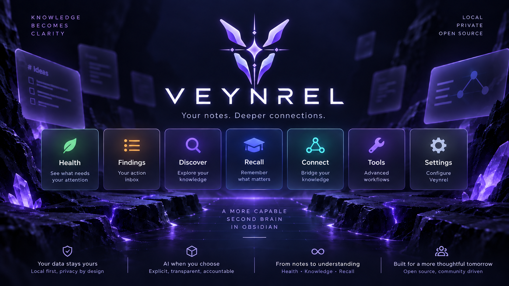

# Veynrel



<p align="center">
  <strong>Your notes. Deeper connections.</strong>
</p>

<p align="center">
  Turn your Obsidian vault into a healthier, searchable, connected knowledge system.
</p>

<p align="center">
  <a href="https://github.com/zinverno/veynrel/releases">Releases</a>
  ·
  <a href="https://github.com/zinverno/veynrel/stargazers">Star Veynrel</a>
  ·
  <a href="https://github.com/zinverno/veynrel/blob/main/LICENSE">MIT License</a>
</p>

---

## What is Veynrel?

Veynrel is an open-source knowledge system for Obsidian.

It helps you answer three simple questions:

- **What in my vault needs attention?**
- **What knowledge am I missing, forgetting, or duplicating?**
- **How can AI help without taking control away from me?**

Instead of being a collection of unrelated AI commands, Veynrel brings vault analysis, semantic discovery, spaced repetition, AI-assisted workflows, and external agent integration into one workspace.

```text
Health → Findings → Discover → Recall → Connect → Tools → Settings
```

AI is explicit. Local features stay local. External agents cannot silently rewrite your vault.

---

## The Veynrel workspace

### Health

**See what needs your attention.**

Veynrel looks at your vault through four dimensions:

- **Structure** — broken links, orphan notes, weak note structure, disconnected areas.
- **Connections** — graph issues, exact duplicates, semantic duplicates and relationship quality.
- **Recall** — what is due for review in native spaced repetition.
- **Knowledge** — explicit LLM-assisted signals for notes that may be underdeveloped.

Health is not a mysterious score.

You see concrete states, evidence, and actions.

---

### Findings

**Your action inbox.**

Every meaningful issue can become a Finding.

Findings can be:

- reviewed,
- opened in context,
- dismissed,
- snoozed,
- reopened,
- automatically resolved when the underlying issue disappears.

Veynrel keeps the observation separate from your decision about it.

---

### Discover

**Explore your vault by meaning.**

Discover brings semantic exploration into one place:

- semantic search,
- related notes,
- potential semantic duplicates,
- explicit Semantic Health checks.

Veynrel reuses one persistent semantic index rather than building separate indexes for every feature.

> Semantic similarity is a discovery signal, not proof that two notes are identical.

---

### Recall

**Remember what matters.**

Veynrel includes native spaced repetition powered by **FSRS-6**.

No third-party review plugin is required.

Supported cards use simple Markdown:

```markdown
## Flashcards

What is retrieval practice::Actively recalling information instead of rereading it
Why use spaced repetition::It schedules reviews near the point of forgetting
```

Recall gives you:

- explicit flashcard discovery,
- local scheduling,
- due queues,
- Question → Reveal answer,
- **Again / Hard / Good / Easy**,
- preserved scheduling across restarts,
- Recall Health on the main dashboard.

You can also explicitly generate flashcards for the current note with your configured language model. Generated cards are appended to Markdown and immediately become available to native Recall.

---

### Connect

**Bridge your knowledge to external tools and agents.**

Veynrel Connect is the product surface for the optional
[Veynrel Companion](https://github.com/zinverno/veynrel-companion).

It can expose a synchronized mirror of your vault to external MCP clients for:

- vault status,
- note listing and reading,
- chunk retrieval,
- semantic search,
- proposed note changes.

External agents **cannot directly write your Obsidian vault** through this workflow.

They may submit a proposal. You inspect it in Obsidian and explicitly choose **Approve** or **Reject**.

```text
External agent
      ↓
Veynrel Companion
      ↓
Proposed change
      ↓
Review in Obsidian
      ↓
Approve / Reject
```

The plugin remains the authoritative vault writer.

---

### Tools

**Advanced workflows without cluttering the main product loops.**

Tools keeps existing power-user workflows available:

- Ask your Vault,
- Deep Audit / Single Audit,
- batch processing,
- MOC generation,
- legacy vault reports.

Editor-specific workflows such as AI writing, selection transforms, Dataview generation, and atomization remain available through the command palette and editor context menu.

---

### Settings

**Understand what powers Veynrel.**

The product Settings page summarizes:

- Deep Intelligence,
- Semantic Intelligence,
- Veynrel Connect,
- native Recall.

Advanced configuration remains available through Obsidian Settings for:

- providers and models,
- embedding configuration,
- Companion endpoint and timeout,
- Deep Audit tuning,
- output folders,
- insertion behavior,
- interface preferences.

Language-model, embedding, and Companion credentials remain separate.

---

## Why Veynrel is different

### Local-first where it matters

Local Health checks and Recall scheduling do not require an AI provider.

Your semantic vector index is stored inside your Obsidian plugin data.

Ollama can keep language-model and embedding work local when configured against a local endpoint.

### AI only when you ask for it

Opening Veynrel does not automatically:

- scan your vault,
- build an index,
- call a language model,
- contact Companion,
- generate flashcards,
- rewrite notes.

Network work and note mutations belong to explicit user actions.

### No opaque “knowledge score”

Veynrel does not compress your vault into one meaningless 0–100 number.

Health shows concrete dimensions, coverage, findings, and evidence.

### Human approval stays in the loop

Knowledge Health is a review signal, not a truth detector.

Semantic duplicates are suggestions, not automatic merges.

External MCP clients can propose changes, but they cannot bypass explicit approval in Obsidian.

---

## Quick start

### 1. Open Veynrel

Use the ribbon icon or run:

**Open Veynrel Health**

Start with the local Health scan. It requires no AI provider.

### 2. Enable Semantic Intelligence

From the Veynrel workspace or Advanced Settings:

1. choose an embedding provider,
2. choose a model,
3. test the connection,
4. explicitly build the first semantic index.

After the first index exists, normal Markdown edits can be synchronized incrementally.

### 3. Configure Deep Intelligence

Choose your language-model provider:

- Ollama,
- OpenRouter,
- OpenAI,
- Groq,
- custom OpenAI-compatible endpoint.

Deep Intelligence powers Knowledge Health and the existing AI-assisted workflows.

### 4. Try Recall

Create or find cards under a `Flashcards` heading and choose **Find flashcards**.

Review them directly inside Veynrel.

### 5. Optional: Connect

If you run Veynrel Companion, open **Connect** to configure the endpoint, test the connection, synchronize the mirror, and review proposed changes.

---

## Supported providers

### Language models

- Ollama
- OpenRouter
- OpenAI
- Groq
- Custom OpenAI-compatible endpoints

### Embeddings

- Ollama
- OpenRouter
- OpenAI-compatible endpoints

Provider availability, pricing, retention, and rate limits are controlled by the provider you choose.

---

## Privacy model

Veynrel separates local state from explicit provider-side processing.

| Feature | What happens |
| --- | --- |
| Health — local checks | Local vault analysis, no provider required |
| Recall discovery/review | Local inventory and FSRS scheduling |
| Semantic indexing | Note chunks go to the configured embedding provider when remote |
| Semantic search | Query goes to the configured embedding provider when remote |
| Knowledge Health | Confirmed eligible note content goes to the configured language model |
| AI writing / authoring | Only the content required for the explicit action is sent |
| Connect | A disclosed mirror is sent to the configured Companion endpoint |
| MCP proposals | Stored on Companion; no vault write until explicit Obsidian approval |

Veynrel has no telemetry or analytics.

Provider API keys are not sent to Companion. The Companion token is not sent to AI providers. MCP authentication is configured separately on the Companion server.

A local vector index does not make a remote embedding provider local. Review the privacy policy of any remote service before sending sensitive notes.

For the full data-flow and durability model, see the project documentation in [`docs/`](docs/).

---

## Local data

Veynrel keeps feature state inside the existing plugin directory:

```text
<your-vault>/<configDir>/plugins/ai-knowledge-hub/
```

Main locations:

| Path | Purpose |
| --- | --- |
| `data.json` | Plugin settings and provider configuration |
| `semantic-index/` | Persistent semantic vectors |
| `note-index.json` | Legacy Deep Audit cache and saved clusters |
| `health/` | Findings, scan receipts and Health recovery data |
| `recall/cards.json` | Native Recall inventory and FSRS scheduling |
| `recall/recovery/` | Explicit Recall recovery backups |

Not every file exists in every setup.

The historical plugin ID remains `ai-knowledge-hub` for update compatibility.

---

## Installation

### Obsidian Community Plugins

1. Open **Settings → Community plugins**.
2. Select **Browse**.
3. Search for **Veynrel**.
4. Install and enable it.

### Manual installation

Download these three files from the same
[GitHub Release](https://github.com/zinverno/veynrel/releases):

```text
main.js
manifest.json
styles.css
```

Place them in:

```text
<your-vault>/.obsidian/plugins/ai-knowledge-hub/
```

Reload Obsidian and enable Veynrel.

### Updating from an older version

Veynrel keeps the same Community Plugin ID.

Update normally. Do not create a second plugin folder.

Existing compatible settings, semantic index data, Companion identity, notes, and legacy Deep Audit data are preserved.

Newer Health and Recall storage is additive.

---

## Existing commands stay available

Veynrel still supports the fast command-palette and editor workflows that existed before the new workspace.

Examples include:

- Semantic search
- Ask your Vault
- Find similar notes
- Find potential semantic duplicates
- Update / rebuild semantic index
- AI writing
- Process selection
- Generate Dataview
- Generate flashcards
- Batch processing
- Atomize note
- Deep Audit
- Generate MOCs
- Review AI change proposals

Existing command IDs remain compatible with old hotkeys and automation.

---

## Architecture

At a high level:

```text
                    ┌─────────────────────┐
                    │      Obsidian       │
                    │    Markdown vault   │
                    └──────────┬──────────┘
                               │
             ┌─────────────────┼─────────────────┐
             │                 │                 │
             ▼                 ▼                 ▼
      Local Health       Semantic Index      Native Recall
             │                 │                 │
             ▼                 ▼                 ▼
         Findings          Discover           FSRS-6
             │                 │                 │
             └────────────┬────┴────────────┬────┘
                          │                 │
                          ▼                 ▼
                     Veynrel UI      Deep Intelligence
                          │                 │
                          └────────┬────────┘
                                   ▼
                               Knowledge
                                   │
                                   ▼
                               Findings

Optional:

Semantic mirror → Veynrel Companion → MCP clients → proposals → explicit approval
```

The main design principle is simple:

> **Analysis may suggest. Veynrel shows evidence. The user decides.**

---

## Current limitations

- Semantic indexing is explicit for the first build and after incompatible embedding-space changes.
- Similarity search currently uses a local linear scan.
- Potential duplicate detection performs pairwise document comparison and is intended for personal vault sizes.
- Ask your Vault is currently a one-shot flow rather than a persistent chat.
- Knowledge Health is an LLM-assisted quality signal, not factual verification.
- Native Recall currently focuses on a single built-in review workflow rather than decks, daily limits, or optimizer analytics.
- Companion is self-hosted and does not provide a hosted Veynrel account service.
- Some multi-file operations are deliberately not crash-atomic; recovery behavior is documented separately.

---

## Development

```bash
npm ci
npm test
npm run typecheck
npm run lint
npm run audit:proposals
npm run build
```

Veynrel and Veynrel Companion are developed as separate repositories with a stable protocol boundary.

For Companion integration development:

```bash
git clone https://github.com/zinverno/veynrel-companion.git ../veynrel-companion
npm run companion:smoke-sibling
```

See [`docs/`](docs/) for architecture, storage contracts, release verification, Recall scheduling, Health semantics, Connect, and migration details.

---

## Contributing

Issues, bug reports, architecture discussions, feature ideas, and pull requests are welcome.

If Veynrel is useful to you, consider starring the repository. It helps other Obsidian users discover the project.

---

## Support Veynrel

Veynrel is free and open source.

If you want to support continued development:

[Support Veynrel on Boosty](https://boosty.to/veynrel)

---

## License

[MIT](LICENSE) © 2026 Zinvernix
