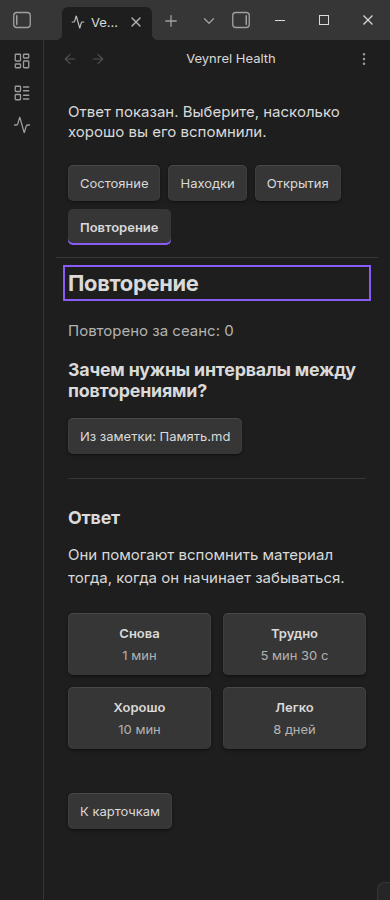

# Integrated Veynrel MVP hardening

Baseline: PR #40 merged at `06fad75ea6ca0d4b85df57ca12cefc6325aeb40e`.
Audit branch: `chore/mvp-hardening`. This establishes a release candidate baseline;
it is not a release, feature expansion, or dependency upgrade.

The current MVP is **Local Health + Findings + Semantic Intelligence + Discover +
Semantic duplicate Health + native Recall/FSRS-6 + Recall Health**, with onboarding,
scoped recovery, EN/RU and durable restart behavior. Knowledge remains Not enabled.
Deep Audit remains a legacy/Advanced tool. Knowledge Health, Deep Intelligence,
Hidden Connections, Connect productization, Recall history and optimization are
not complete and are not added here.

Subsequent roadmap work adds [Deep Intelligence setup](deep-intelligence-setup.md)
for the existing language-model configuration. This audit remains the historical
PR #41 baseline; Knowledge Health analysis remains unimplemented.

## Architecture and authoritative ownership

```text
AIHubPlugin (one plugin lifetime)
  ├─ settings save queue → data.json
  ├─ ObsidianSemanticController → runtime / shared store registry → semantic-index/
  │    ├─ SemanticIntelligenceController → Health-side product port → Home / Discover
  │    └─ SemanticHealthAnalysisAdapter → Health-side analysis port
  └─ registerHealth
       ├─ HealthPluginController → lazy HealthService → FindingStore → health/
       └─ RecallProductController → lazy RecallService → RecallStore → recall/
            └─ RecallHealthAdapter → Health-side count/status port

VeynrelHealthView × N → the same injected controllers and capabilities
  Health | Findings | Discover | Recall
```

There is one construction site for each named owner, now enforced by
`health/obsidian/healthBoundary.test.ts`. Views create no stores or services.
Health and Recall recovery replace only their own blocked service after scoped
recovery. Semantic operations share the existing runtime registry and mutation
queue, including its cross-lifecycle serialization. A second view observes the
same durable state. Only one view may own the transient Recall review surface;
closing a non-owning view does not end the owning session.

## Audit findings and bounded fixes

Source/caller review preceded production edits. The four failing focused
regressions reproduced the first three rows below before the fixes.

| Area | Observed baseline behavior | Expected invariant | Evidence | Severity | Action |
| --- | --- | --- | --- | --- | --- |
| Startup / existing index | Layout-ready reads even unchanged notes; offline edits cause embeddings | Startup performs no scan/provider work | Existing startup tests plus new `MVP startup` regressions | High | Defer the existing queued reconciliation until real Markdown activity; no startup timer |
| Startup / Companion | Layout-ready can capture and send the existing mirror, in addition to semantic reconciliation | No startup network request | Enabled-Companion regression with a persisted index | Medium | Remove only the startup mirror trigger; explicit sync and synchronization after index commits remain |
| Semantic product publication | Advanced commands and automatic sync change the engine but never notify mounted product views | All views observe the same owner | New subscriber regression; native Advanced command Busy → Ready DOM capture | Medium | Engine status subscriptions; coalesced microtask notification; view unsubscription and engine disposal cleanup |
| Busy state | Reading cached status before a runtime exists can mask an active manual operation or metadata inspection as not initialized | An active operation remains Busy | Subscriber regression observes first-index Busy | Part of publication defect | Preserve `operationBusy` and `initializing` in the existing cached-status branches |
| Ownership, storage, recovery | Existing owners and scoped recovery are correct | No duplicate owners/cross-domain reset | Structural test, integrated byte comparisons, two-view native check | Pass | Regression evidence only |
| UI, localization, privacy | No verified defect in audited surfaces | Safe, usable existing product | 208 native layout cases, keyboard/DOM checks, existing privacy tests | Pass | No UI/CSS/copy rewrite |
| Dependencies | Seven vulnerable development dependency nodes | Accurate exposure assessment; no blind upgrades | Registry audit, production bundle metadata | Deferred | Dedicated dependency maintenance |
| Streaming API lint | Existing `fetch` warning at `api.ts:413` | Preserve streaming and cancellation | `response.body.getReader()` versus buffered Obsidian `RequestUrlResponse` | Pre-existing | Retain and document; no API refactor |

Only two production files change: the existing semantic engine and its product
controller. No persistent schema, scheduler, analyzer, recommendation policy,
Health storage, Recall implementation, or setting is redesigned.

## Passive IO matrix

“Passive” means no explicit work action and no concurrent user-driven Markdown
edit. Existing automatic synchronization may still run after actual note changes;
opening a page does not cause that work.

| Entry | Allowed reads | Writes | Markdown enumeration / reads | Provider / network |
| --- | --- | --- | --- | --- |
| Plugin load / construction | Existing plugin `data.json` load | Existing one-time Companion vault-ID migration if absent/invalid | None | None |
| Initial Health onboarding | Health findings/history metadata | Profile/completion only when explicitly selected | None | None |
| Normal Health | Health metadata; lazy `recall/cards.json` after onboarding and Health recovery | None | None | None |
| Findings | Committed Health state | None | None | None |
| Discover | Cached semantic status and committed Health state | None | None | None |
| Recall | Recall metadata if not initialized | None | None | None |
| Recall due-time wakeup | In-memory Recall summary | None | None | None |

Normal workspace entry initializes Recall once, regardless of which normal tab
subsequently renders. No extra Recall reader exists for Health. Onboarding and
blocking Health recovery keep Recall dormant. Settings persistence is not claimed
to be zero on a brand-new install: the pre-existing vault-ID migration is explicit
in this matrix. Neither startup nor passive pages start Deep Audit.

An existing semantic index remains cached as uninspected after restart until an
explicit **Check setup** or another semantic action inspects it. Check uses the
persisted embedding descriptor and index metadata, with no provider dimension
probe or Markdown reads. Startup queues reconciliation in memory, deferring it
until actual Markdown activity. Explicit indexing also reconciles offline changes.
Companion does not synchronize merely because the plugin starts; explicit Sync or
a subsequent semantic index commit owns synchronization.

## Explicit actions and storage ownership

| Action | Markdown | Provider / network | Owned mutations |
| --- | --- | --- | --- |
| Local Scan | Enumerate/read local notes | None | `health/findings.json`, `health/scan-runs.json` |
| Semantic Connect | None | Fixed test phrase only | Semantic portion of `data.json`, after successful test |
| Check setup | None | None | None |
| Build / Rebuild index | Enumerate/read, after existing privacy confirmation | Selected embedding provider; optional configured Companion after commit | `semantic-index/`; existing automatic-sync preference when necessary |
| Potential duplicates | Existing local vectors | None | None: exploratory results |
| Check semantic duplicates | Existing local vectors | None | Health Findings/history only |
| Recall Find / Refresh | Deterministic explicit enumeration/reads | None | `recall/cards.json` |
| Recall Again / Hard / Good / Easy | None | None | `recall/cards.json` only |
| Dismiss / Snooze / Reopen | None | None | Health Finding lifecycle; analyzer receipts and scan history unchanged |
| Health recovery | None | None | Backup/move the affected Health files only |
| Recall recovery | None | None | Backup/move the single Recall file only |

The integrated fixture uses one adapter containing settings, Health files, Recall
metadata and a real synthetic vector index. It checks exact unrelated bytes after
local scan, index build, Semantic Health, lifecycle changes, inventory, review and
both recoveries. Recall due state creates no Finding, receipt or ScanRun and writes
no Health file. Semantic Health leaves Recall/index/settings bytes unchanged;
Local Health leaves the index/Recall/settings unchanged. Existing recovery failure
and rollback suites remain in force.

## Restart and migration matrix

| Durable state | Verified result after recreation |
| --- | --- |
| Completed Local Health | Findings, scan history and valid scope receipts restored without rescanning |
| Semantic duplicate Health | Semantic Findings and semantic receipts restored independently of Local |
| Dismissed / snoozed Findings | Lifecycle preserved; analyzer receipts do not advance from user actions |
| Ready semantic index | Explicit metadata-only Check restores Ready; no automatic build/provider test |
| Reviewed Recall | Native Health shows persisted due/active state before visiting Recall |
| Learning / Relearning | Existing scheduler/product restart tests preserve phase, decision time and schedule |
| Future Recall due time | Initially Good, then Review recommended at the stored deadline without IO |
| Health v1 | Valid files migrate in memory to current receipt semantics; no read-triggered write |
| Recall v1 | Valid active cards gain initial v2 schedules in memory and are due/new; no migration write |
| Existing semantic descriptor/index | Compatible metadata reused; incompatible data preserved until explicit rebuild |
| Older `data.json` | Existing defaults/provider inference applied; LLM, Deep Audit, Semantic, Companion and ordinary preferences retained |

The native combined legacy fixture includes old settings with missing provider,
Health v1, Recall v1 and the existing semantic index. It loaded all four active
cards as due/new, retained settings, inferred Ollama from the legacy local LLM URL,
and left all seeded metadata bytes unchanged. No recovery was offered for valid
supported legacy data. Supported migration is not a guarantee for arbitrary future
or malformed schemas; those remain safely blocked.

## Recovery matrix

| Damage | Product behavior | Isolation |
| --- | --- | --- |
| Findings damaged | Blocking Health recovery, confirmation, backup/reset of Health findings/history | Recall/index/settings untouched |
| History damaged | Blocking history-only Health recovery | Findings and Recall/index/settings untouched |
| Recall damaged / unsupported | Recall card directs into scoped Recall recovery; Health scan, Findings and Discover usable | No global Health failure or Health reset |
| Recall unavailable | Safe localized Retry/recovery surface | No overwrite or raw error |
| Semantic incompatible | Rebuild/Change setup offered | No automatic destruction or provider call |
| Health + Recall damaged | Health recovery dominates first; Recall remains dormant; after Health recovery, independent Recall recovery appears | No reset affects both domains |

Both simultaneous-damage combinations (damaged Findings or damaged history plus
Recall) have automated regressions. Native smoke exercised damaged Findings plus
Recall, modal confirmation, independent backup/reset, and Recall returning to
**Not enabled**, without an inventory scan.

## Async completion, multiple views and time

| Operation | Verified boundary |
| --- | --- |
| Local / Semantic Health scan | Plugin-owned single flight; view close detaches; scan result cannot restore a closed route; notifications follow persistence |
| Semantic Connect | Draft copied before await; settings save queue rejects stale Advanced edits; route/epoch checks discard obsolete UI completion |
| Semantic Build / Rebuild | Existing shared mutation queue and confirmation; all mounted product views now see external Busy/Ready/error changes |
| Recall inventory | One owner, persist-first; close leaves durable product work owned by plugin; plugin disposal cancels inventory |
| Recall review | One issued schedule write; session object identity prevents navigation/close resurrecting question/reveal UI |
| Health / Recall recovery | Exclusive within its domain, backups first; replacement owner only after recovery; detached subscribers cannot fail commits |
| Settings | Same existing serialized queue for ordinary, Health and Semantic changes; added combined-domain preservation regression |

Subscriber exceptions cannot turn a successful durable operation into a failure.
Semantic status delivery uses a coalesced microtask, not a timer or poll, to avoid
reentrant rendering from cached status reads. Each view removes its own engine
listener on close; plugin disposal clears the engine's remaining listeners.

Recall overview and Health each use the existing single view-local due wakeup when
relevant. A new snapshot cancels/recomputes it; navigation/close clears it. Long
delays clamp to `2_147_483_647` milliseconds and recheck on the next render. The
bounded timer and crossed-deadline regressions pass. The native Again check waited
for the real one-minute boundary and observed Good → Review recommended with zero
metadata/Markdown/network/write work. These timers do not own services or perform
reviews. No new recurring timer is introduced.

## Product semantics, privacy, commands and settings

The pure aggregation matrix combines Local absent/completed/partial coverage,
Semantic absent/completed/partial/failed coverage and every Recall load/workload
state. Structure remains Local/basic; Connections may add Semantic depth; Recall
only reflects tracked scheduling state; Knowledge stays disabled. A dimension does
not downgrade another. Zero active cards is neutral, first-run is Not enabled,
and a nonempty due queue is Review recommended. Tracked active cards with zero due
are Good. This does not establish fresh inventory or objectively good memory.

Structure/Connections cards open their Findings filters. Recall opens Recall;
Knowledge remains non-actionable. Recommendations stay Finding-based. Existing
Open/Dismiss/Snooze/Resolved/Recurrence and source-scoped receipt regressions pass
for Local and Semantic Findings; due Recall cards never enter that ranking.

Potential duplicates is exploratory; Check semantic duplicates persists Health
Findings. Find/Refresh flashcards owns inventory; Start review owns the due queue;
ratings own scheduling. No page silently conflates those actions.

Before reveal, Recall DOM/public session contains no answer. Health receives only
allowlisted load state/counts/deadline, never card text, memory parameters or keys.
Semantic product snapshots exclude credentials, endpoint, raw errors and vectors.
Semantic Finding evidence contains bounded paths/counts/similarity, not chunk
previews or full note bodies. Native DOM checks and existing dependency/privacy
regressions passed. Explicit semantic indexing does send note chunks to the chosen
provider under its existing confirmation; that behavior is not attributed to
passive Health.

All **21 current command IDs** remain registered, including Health, legacy panel
and batch tools, Deep Audit, flashcards, semantic search/index/clear/rebuild, Ask
Vault and proposal review. No command/settings definition was removed or renamed.
The shared settings queue retains LLM, Deep Audit, Companion, Health preferences,
Semantic and ordinary plugin settings; Recall stays separate metadata.

## Native evidence and limitations

See [native results](mvp-hardening-evidence/native.json). Real isolated Obsidian
API **1.12.7**, Electron **39.8.10**, Linux/X11; only this plugin installed; no
external spaced-repetition plugin, personal vault or credentials. The fixture
transport returned deterministic vectors inside the isolated plugin's
`requestUrl` facade. It made no actual HTTP/provider call. This verifies action
boundaries and integration, not embedding quality or a live vendor's service.

The coherent journey covered onboarding → explicit Local scan → Finding detail,
Dismiss and Snooze → custom semantic setup/fixed phrase → confirmed index build →
Discover → persisted semantic duplicate Findings → explicit Recall discovery →
question/reveal/four Easy reviews → Good Health → plugin restart. Separate checks
covered real Again time passage, Advanced-command live updates, combined legacy
upgrade, incompatible semantic metadata, simultaneous Health/Recall corruption,
scoped recovery, two views and plugin unload cleanup.

**208 cases**: 13 surfaces × EN/RU × dark/light × 320/390/768/1280 pixels. Surfaces
include onboarding, Home, Findings list/detail, semantic setup, Discover, semantic
Finding detail, Recall overview/question/revealed ratings, Health recovery, Recall
recovery and Recall confirmation. All fit horizontally, kept buttons within the
content width, and contained no raw translation key or stale main-product branding.
Native Enter activated the Recall Health button; focus was visible (2px outline),
`aria-current` followed navigation and the status region stayed polite. Native Tab/Space/reveal and rating-key checks also passed. Unit tests cover
keyboard scoping, `aria-busy`, answer focus and recovery safety.
No CSS or localization fix was justified by this audit.

After final review strengthened initialization-state coverage, the final rebuilt
bundle was rechecked natively: passive startup, persisted Recall on Health, and
held metadata inspection all passed, with Busy → Ready and no intermediate
Configured state. The evidence retains hashes for both the full journey build and
this final follow-up build.



Narrow desktop emulation is not native mobile certification. Full screen-reader,
custom-theme, macOS/Windows/mobile and pop-out certification are not claimed. The
native process was isolated and synthetic; the restart check recreated the plugin
in real Obsidian. Existing scheduler/reference tests provide broader algorithm and
long-deadline coverage than the short native journey.

Harness-only corrections: compare parsed Finding objects (serialized key order
changes on reload), use the Health modal's actual warning-button selector, and
confirm the Advanced index command's existing privacy modal. None required a
production change. Sandbox loopback/process restrictions required approved host
reruns. The proposal audit's initial sandbox child run produced no readable test
output; the host rerun killed all five mutations and passed restored tests.

## Build, advisories and verification

Production bundle: **638,764 bytes**, **134 contributing local modules**, with only
`obsidian` external. No test fixture, Python generator, golden JSON, evidence file
or dependency from `node_modules` contributes bytes. Only one FSRS algorithm
implementation (`recall/scheduler/fsrs6.ts`) is included. Bundle membership was
checked through `.esbuild/meta.json`; no size optimization was attempted.

Registry audit on 2026-09-24 reports **7 vulnerable dependency nodes: 4 moderate,
3 high, 0 critical**. These are development dependencies, not seven distinct
advisories. In particular Vitest and its mocker share an advisory, while fast-uri
has multiple advisories. `npm audit --omit=dev` reports **0 vulnerabilities**.

| Dependency | Severity | Advisory / relevant development surface |
| --- | --- | --- |
| `@vitest/mocker`, `vitest` | Moderate (two nodes) | [GHSA-82fw-gwwq-j7x9](https://github.com/advisories/GHSA-82fw-gwwq-j7x9), mock-server path traversal |
| `esbuild` | Moderate | [GHSA-67mh-4wv8-2f99](https://github.com/advisories/GHSA-67mh-4wv8-2f99), development server cross-origin reads |
| `fast-uri` | High | [5jgf](https://github.com/advisories/GHSA-5jgf-p345-68v8), [f65p](https://github.com/advisories/GHSA-f65p-4m7j-42xc), [fph4](https://github.com/advisories/GHSA-fph4-wmhf-6fwf), [jqff](https://github.com/advisories/GHSA-jqff-g426-hqxp): URI host/scheme confusion |
| `js-yaml` | High | [GHSA-2883-xcg3-v3hh](https://github.com/advisories/GHSA-2883-xcg3-v3hh), empty-merge CPU denial of service |
| `nanoid` | High | [GHSA-2v37-7h3g-55p8](https://github.com/advisories/GHSA-2v37-7h3g-55p8), zero-size custom generator loop |
| `postcss` | Moderate | [GHSA-fxqj-rqcc-2cmp](https://github.com/advisories/GHSA-fxqj-rqcc-2cmp), source-map file read |

None is directly present in shipped plugin code. This does not eliminate tooling
risk. Dependency changes are deferred to a maintenance PR; lockfile and production
dependencies remain unchanged. The `api.ts:413` warning is intentional streaming
`fetch`: Obsidian's public `RequestUrlResponse` exposes buffered text/JSON/bytes,
not the readable response stream required here. A switch to `requestUrl` would
change streaming/cancellation behavior. The pre-existing warning remains visible.

Verification: `npm ci`, typecheck, Health (**728 / 35 files**), Recall (**427 / 18**),
Semantic (**345 / 17**), full suite (**1,983 / 84**), focused MVP integration
(**8**) and boundary/aggregation/settings checks (**23 / 3**), targeted ESLint,
full lint, proposal mutation audit (**5/5**), production build and diff whitespace
check. Seven tests were added; existing startup expectations were deliberately
updated to enforce the new passive contract, not removed. The aggregation test
also exercises 108 Local/Semantic/Recall combinations. Full lint has zero errors
and the one pre-existing streaming warning. GitHub CI must pass for the final PR
head before handoff; its status is reported in the PR/final handoff.

No version, manifest, tag or release changes. The PR is left open and unmerged.
No remaining integrated-MVP correctness blocker was observed in the tested scope.
Dependency advisories, streaming API policy, broader native platform/accessibility
coverage and power-loss atomicity remain release-review limitations, not silently
claimed as solved.

## Deferred post-MVP work

1. Dedicated dependency maintenance and expanded native accessibility/platform QA.
2. Knowledge Health / Deep Intelligence, with a separate product and persistence
   contract; existing legacy Deep Audit is not that product.
3. Hidden Connections and Connect productization as separate scoped work.
4. Recall history/optimizer/decks/limits only with explicit future requirements.
5. Stronger power-loss/journaling guarantees if required; current persisted-write
   and recovery contracts are retained rather than redesigned in this audit.
